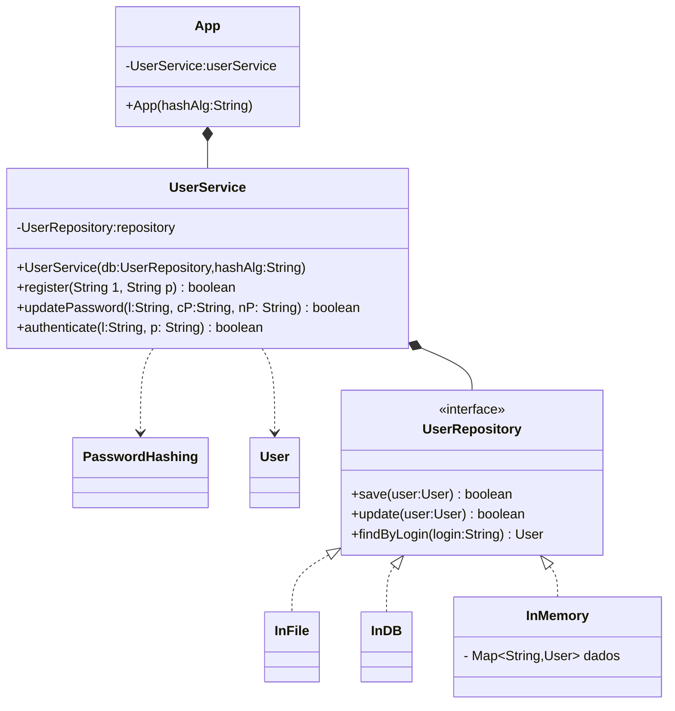

```mermaid
classDiagram
    class PasswordHashing
    class App {
        -UserService:userService
        +App(hashAlg:String)
    }
    class User
    class UserService{
        -UserRepository:repository
        +UserService(db:UserRepository,hashAlg:String)
        +register(String 1, String p ) boolean
        +updatePassword(l:String, cP:String, nP: String) boolean
        +authenticate(l:String, p: String ) boolean
        }
    class UserRepository{
        <<interface>>
        +save(user:User) boolean
        +update(user:User)boolean
        +findByLogin(login:String) User
    }
    class InMemory{
        - Map~String,User~ dados
    }
    
    UserRepository <|.. InFile
    UserRepository <|.. InDB
    UserRepository <|.. InMemory
    App *-- UserService
    UserService ..> User
    UserService *-- UserRepository
    UserService ..> PasswordHashing

```
